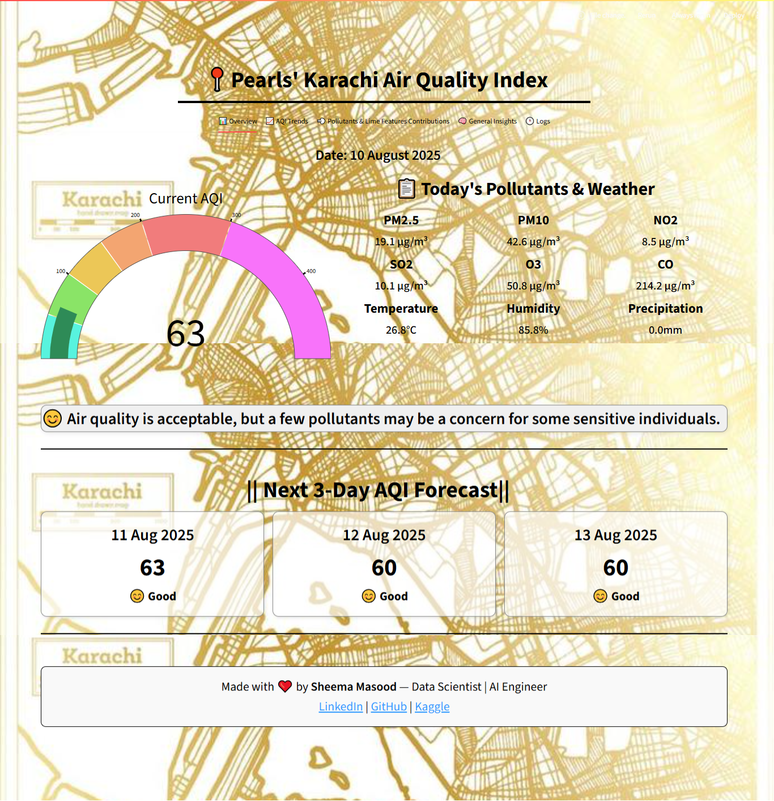

# Pearls' Karachi Air Quality Index (AQI) Prediction

*Breathe Easier with Tomorrow’s Air Quality Insights*

[](https://github.com/SheemaMasood381/Pearls-Karachi-AQI-Prediction-for-next-3-days-/commits/main)
[](https://github.com/SheemaMasood381/Pearls-Karachi-AQI-Prediction-for-next-3-days-/tree/main/notebooks)
[]()
[](https://opensource.org/licenses/MIT)

**Built with the tools and technologies:**


---

## Overview

**Karachi-AQI-Prediction** is a comprehensive tool designed for real-time air quality monitoring and forecasting in Karachi. It integrates data collection, preprocessing, machine learning, and visualization to provide accurate and interpretable AQI predictions. This project delivers a 3-day forecast, trend analysis, and pollutant insights, adhering to WHO standards, and uses LIME for model interpretability.

### Why Karachi-AQI-Prediction?

This project helps build transparent, predictive environmental dashboards with ease. The core features include:

- 📋 **Data Collection & Preprocessing:** Automates fetching and cleaning environmental data for reliable analysis.
- 🔮 **Multi-step Forecasting:** Provides 3-day AQI predictions to support proactive health and safety decisions.
- 🧠 **Model Interpretability:** Uses LIME explanations to demystify model predictions and build trust.
- ⚙️ **Automated Pipelines:** Seamlessly integrates data updates, model training, and deployment for continuous insights.
- 📊 **Interactive Visualization:** Empowers users to explore air quality trends through intuitive dashboards.

📍 This is a **Real-Time Karachi AQI Prediction Web App** that forecasts the next **3 days of air quality**, visualizes trends, and compares pollution levels with **WHO standards**.
[](https://pearls-karachi-aqi-prediction-for-next-3.onrender.com/)

-----------
<table style="width:100%; table-layout: fixed;">
  <tr>
    <th>📊 Overview</th>
    <th>🧭 WHO Analysis</th>
    <th>💨 Pollutants and Lime features' Contribution</th>
    <th>🧠 General Insights</th>
    <th>🕒 Logs</th>
  </tr>
  <tr>
    <td></td>
    <td></td>
    <td></td>
    <td></td>
    <td></td>
  </tr>
</table>

## 🌟 Key Features

- **Daily AQI & Pollutants:** Interactive view of Karachi's current AQI and pollutant breakdown.
- **3-Day AQI Forecast:** Next 3 days' AQI predicted using an **LSTM deep learning model**, updated daily.
- **Trend Analysis:** Explore seasonal, monthly, and weekday trends with interactive plots.
- **Pollutant Insights:** Radar and pie charts show pollutant risk vs WHO standards and composition.
- **WHO Comparison:** Instantly see how Karachi fares against global safety limits.
- **🧠 LIME Model Interpretability:** Local Interpretable Model-agnostic Explanations (LIME) highlight feature contributions for individual AQI predictions, enhancing model transparency and trust.
- **Logs & Model Stats:** Transparent logs—see last update, model performance, and data pipeline status.
- **Fully Responsive UI:** Clean, modern, and mobile-friendly with custom CSS and Plotly visuals.
- **CI/CD Automation:** End-to-end daily update pipeline via GitHub Actions.

---

## 🛠️ Tech Stack

- **Frontend:** [Streamlit](https://streamlit.io/) (Plotly, custom HTML/CSS)
- **Backend/ML:** Python, scikit-learn, TensorFlow (LSTM), pandas, NumPy , LIME
- **Deployment:** Render.com (free web service)
- **Data Sources:** Open-Meteo Air Quality & Weather APIs
- **DevOps:** GitHub Actions (CI/CD, daily fetch/train/predict)
- **Visualization:** Plotly, Matplotlib, seaborn

---

## 📂 Folder Structure

```
karachi-aqi-app/
├── app.py                           # Main Streamlit dashboard
├── requirements.txt                 # Python dependencies
├── src/                            # Data & ML pipeline scripts
│   ├── update_daily_data.py         # Fetches & updates daily data
│   ├── preprocess_daily_data.py     # Cleans, transforms, feature engineering
│   ├── lstm_model_training.py       # Trains LSTM model & logs metrics
│   ├── predict.py                   # Predicts next 3 days AQI
│   ├── fetch_data.py                # Fetches data via APIs
│   └── create_lime.py              # Generates LIME explanations for predictions
├── data/
│   └── karachi_daily_aqi_weather.csv # Raw daily AQI+weather (auto-updated)
├── processed_data/
│   └── daily_karachi_preprocessed.csv # Cleaned, engineered features
├── predictions/
│   └── next_3_days.csv              # LSTM forecast (auto-updated)
├── lstm_model/
│   ├── lstm_aqi_model.keras         # Saved model
│   ├── scaler_X.pkl, scaler_y.pkl   # Scalers
│   ├── metrics.json                 # Last model performance
│   └── update_log.txt               # All update logs
├── lime_explanations/                # LIME model interpretability outputs
│   ├── lime_report.html               # Interactive LIME HTML explanation for last prediction
│   ├── lime_plotly_chart.json         # Plotly JSON chart for dashboard rendering
│   └── lime_feature_contributions.xlsx # Excel file with feature weights/contributions
├── notebooks/                       # Jupyter notebooks for EDA & visualizations
│   ├── *.ipynb                      # Interactive notebooks (EDA, ML, plots)
│   └── visualizations/              # Saved charts/images from notebooks
└── .github/workflows/
    └── aqi_pipeline.yml             # CI/CD pipeline (auto daily update)
```
-------

## ⚡ End-to-End Pipeline

### 1. Data Fetch (`src/update_daily_data.py`)
- Pulls daily AQI & weather for Karachi (Open-Meteo API).
- Appends/updates new day in `data/karachi_daily_aqi_weather.csv`.

### 2. Processing (`src/preprocess_daily_data.py`)
- Cleans, fills, outlier-caps, feature engineers, and encodes data.
- Saves processed output to `processed_data/`.

### 3. Model Training (`src/lstm_model_training.py`)
- Trains an **LSTM** on recent data (sequence length: 7 days).
- Evaluates model (MAE, RMSE, R²) and only saves if performance improves.

### 4. Prediction (`src/predict.py`)
- Loads best model & scalers.
- Predicts next 3 days' AQI.
- Auto-updates `predictions/next_3_days.csv`.

### 5. LIME Explanations (`src/lime_explanations.py`)
- Generates **local explanations** for individual AQI predictions.
- Produces:
  - `lime_report.html` – interactive breakdown.
  - `lime_plotly_chart.json` – dashboard visualization.
  - `lime_feature_contributions.xlsx` – tabular feature weights.
- Displays explanations in dashboard for improved interpretability.

### 6. Dashboard (`app.py`)
- Loads data, predictions, and LIME explanations.
- Provides multi-tab, interactive visual analytics and forecasts.

### 7. CI/CD (`.github/workflows/aqi_pipeline.yml`)
- Runs entire pipeline **daily** and **on push** via GitHub Actions.
- Commits latest predictions & LIME outputs for live dashboard updates.

---

## 🖥️ Run Locally

```
git clone https://github.com/SheemaMasood381/Pearls-Karachi-AQI-Prediction-for-next-3-days-.git
cd Pearls-Karachi-AQI-Prediction-for-next-3-days-
pip install -r requirements.txt
streamlit run app.py
```

> **Note:** Ensure you have Python 3.7+ installed. You might need to install additional dependencies based on your environment.

---

## 🚀 Deploy to Render

1.  Visit [https://render.com](https://render.com)
2.  Click **"New Web Service"**
3.  Connect your GitHub repo
4.  Set configuration:
    -   **Build Command:** `pip install -r requirements.txt`
    -   **Start Command:** `streamlit run app.py`
    -   **Instance Type:** Free (Starter)
5.  Deploy! (CI/CD pipeline will keep it up-to-date.)

> **Important:** Configure environment variables in Render.com if your application requires API keys or sensitive information.

---

## 🧬 Example: CI/CD Workflow

```
on:
  push:
    branches: [main]
  schedule:
    - cron: '0 3 * * *'  # Every day at 3 AM UTC (8 AM PKT)
```


> **Note:** Modify the cron schedule according to your needs. Ensure that the GitHub Actions workflow has the necessary permissions to push changes to your repository.

---

## 🌍 Data Sources

-   [Open-Meteo Air Quality API](https://open-meteo.com/en/docs/air-quality-api)
-   [Open-Meteo Weather Archive API](https://open-meteo.com/en/docs#archive)

> **Note:** You may need to sign up for API keys if the usage exceeds the free tier limits. Add the API keys as environment variables in your deployment environment.

---

## 🎯 Upcoming Enhancements

-   🌐 Real-time AQI API integration (e.g. AirVisual, WAQI)
-   📱 PWA support for mobile alerts/notifications
-   🧠 Enhanced Model explainability (SHAP/LIME insights)
-   📤 Export charts/reports as PDF
-   📈 Implement more sophisticated forecasting models (e.g., Prophet, Transformer models)

> **Contribution:** Feel free to contribute to these enhancements by submitting pull requests.

---

## 👩‍💻 Author

Made with ❤️ by [Sheema Masood](https://www.linkedin.com/in/sheema-masood/)  
_Data Scientist • AI Engineer_  
[GitHub](https://github.com/sheemamasood381/) | [Kaggle](https://www.kaggle.com/sheemamasood)

---

## 📄 License

Distributed under the MIT License — use, modify, and contribute freely.

---
