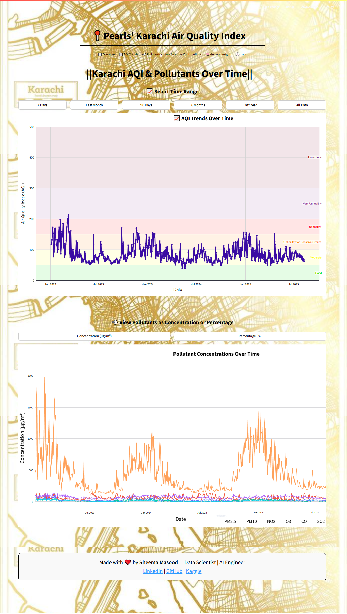

# 📍 Pearls' Karachi AQI Dashboard & 3-Day Forecast

A comprehensive, production-grade web application for visualizing, analyzing, and forecasting Karachi's Air Quality Index (AQI). The project leverages advanced machine learning (LSTM) for prediction, modern data engineering, and a Streamlit-powered, mobile-friendly dashboard.

[](https://pearls-karachi-aqi-prediction-for-next-3.onrender.com)
[](https://www.python.org/)
[](https://streamlit.io/)

📍 This is a **Real-Time Karachi AQI Prediction Web App** that forecasts the next **3 days of air quality**, visualizes trends, and compares pollution levels with **WHO standards**.

-----------
<table style="width:100%; table-layout: fixed;">
  <tr>
    <th>📊 Overview</th>
    <th>🧭 WHO Analysis</th>
    <th>📈 Monthly Trends</th>
    <th>💨 Pollutant Breakdown</th>
    <th>🕒 Logs</th>
  </tr>
  <tr>
    <td></td>
    <td></td>
    <td></td>
    <td></td>
    <td></td>
  </tr>
</table>

## 🌟 Key Features

- **Daily AQI & Pollutants:** Interactive view of Karachi's current AQI and pollutant breakdown.
- **3-Day AQI Forecast:** Next 3 days' AQI predicted using an LSTM deep learning model, updated daily.
- **Trend Analysis:** Explore seasonal, monthly, and weekday trends with interactive plots.
- **Pollutant Insights:** Radar and pie charts show pollutant risk vs WHO standards and composition.
- **WHO Comparison:** Instantly see how Karachi fares against global safety limits.
- **Logs & Model Stats:** Transparent logs—see last update, model performance, and data pipeline status.
- **Fully Responsive UI:** Clean, modern, and mobile-friendly with custom CSS and Plotly visuals.
- **CI/CD Automation:** End-to-end daily update pipeline via GitHub Actions.

---

## 🛠️ Tech Stack

- **Frontend:** [Streamlit](https://streamlit.io/) (Plotly, custom HTML/CSS)
- **Backend/ML:** Python, scikit-learn, TensorFlow (LSTM), pandas, NumPy
- **Deployment:** Render.com (free web service)
- **Data Sources:** Open-Meteo Air Quality & Weather APIs
- **DevOps:** GitHub Actions (CI/CD, daily fetch/train/predict)
- **Visualization:** Plotly, Matplotlib, seaborn

---

## 📂 Folder Structure

```
karachi-aqi-app/
├── app.py                           # Main Streamlit dashboard
├── requirements.txt                 # Python dependencies
├── src/                             # Data & ML pipeline scripts
│   ├── update_daily_data.py         # Fetches & updates daily data
│   ├── preprocess_daily_data.py     # Cleans, transforms, feature engineering
│   ├── lstm_model_training.py       # Trains LSTM model & logs metrics
│   └── predict.py                   # Predicts next 3 days AQI
|   └── fetach_data.py               # fetches the data with api
├── data/
│   └── karachi_daily_aqi_weather.csv # Raw daily AQI+weather (auto-updated)
├── processed_data/
│   └── daily_karachi_preprocessed.csv # Cleaned, engineered features
├── predictions/
│   └── next_3_days.csv              # LSTM forecast (auto-updated)
├── lstm_model/
│   ├── lstm_aqi_model.keras         # Saved model
│   ├── scaler_X.pkl, scaler_y.pkl   # Scalers
│   ├── metrics.json                 # Last model performance
│   └── update_log.txt               # All update logs
├── notebooks/                       # Jupyter notebooks for EDA & visualizations
│   ├── *.ipynb                      # Interactive notebooks (EDA, ML, plots)
│   └── visualizations/              # Saved charts/images from notebooks
└── .github/workflows/
    └── aqi_pipeline.yml               # CI/CD pipeline (auto daily update)
```
---

## ⚡ End-to-End Pipeline

1. **Data Fetch (`src/update_daily_data.py`):**
   - Pulls daily AQI & weather for Karachi (Open-Meteo API).
   - Appends/updates new day in `data/karachi_daily_aqi_weather.csv`.

2. **Processing (`src/preprocess_daily_data.py`):**
   - Cleans, fills, outlier-caps, feature engineers, encodes, and saves to `processed_data/`.

3. **Model Training (`src/lstm_model_training.py`):**
   - Trains an LSTM on recent data (sequence: 7 days).
   - Evaluates, logs (MAE, RMSE, R²), and only saves if improved.

4. **Prediction (`src/predict.py`):**
   - Loads best model & scalers.
   - Predicts next 3 days' AQI (auto-updates `predictions/next_3_days.csv`).

5. **Dashboard (`app.py`):**
   - Loads all above data.
   - Provides multi-tab, interactive visual analytics and forecast.

6. **CI/CD (`.github/workflows/aqi_pipeline.yml`):**
   - Runs entire pipeline daily (and on push) via GitHub Actions.
   - Commits latest prediction to repo for live dashboard.

---

## 🖥️ Run Locally

```bash
git clone https://github.com/your-username/karachi-aqi-pipeline.git
cd karachi-aqi-pipeline
pip install -r requirements.txt
streamlit run app.py
```
- The app will open in your browser at `http://localhost:8501`.

---

## 🚀 Deploy to Render

1. Visit [https://render.com](https://render.com)
2. Click **"New Web Service"**
3. Connect your GitHub repo
4. Set configuration:
   - **Build Command:** `pip install -r requirements.txt`
   - **Start Command:** `streamlit run app.py`
   - **Instance Type:** Free (Starter)
5. Deploy! (CI/CD pipeline will keep it up-to-date.)

---

## 🧬 Example: CI/CD Workflow

```yaml
name: Karachi AQI Daily CI/CD Pipeline
on:
  push:
    branches: [main]
  schedule:
    - cron: '0 3 * * *'  # Every day at 3 AM UTC (8 AM PKT)
jobs:
  run-aqi-pipeline:
    runs-on: ubuntu-latest
    steps:
      - uses: actions/checkout@v3
      - uses: actions/setup-python@v4
        with: { python-version: '3.11' }
      - run: pip install -r requirements.txt
      - run: python src/update_daily_data.py
      - run: python src/preprocess_daily_data.py
      - run: python src/lstm_model_training.py
      - run: python src/predict.py
      - run: |
          git config --global user.name 'github-actions'
          git config --global user.email 'github-actions@github.com'
          git add predictions/next_3_days.csv
          git commit -m "🔮 Auto: Daily AQI Prediction Update [skip ci]" || echo "No changes"
          git push || echo "Nothing to push"
```

---

## 🌍 Data Sources

- [Open-Meteo Air Quality API](https://open-meteo.com/en/docs/air-quality-api)
- [Open-Meteo Weather Archive API](https://open-meteo.com/en/docs#archive)

---

## 🎯 Upcoming Enhancements

- 🌐 Real-time AQI API integration (e.g. AirVisual, WAQI)
- 📱 PWA support for mobile alerts/notifications
- 🧠 Model explainability (SHAP/LIME insights)
- 📤 Export charts/reports as PDF

---

## 👩‍💻 Author

Made with ❤️ by [Sheema Masood](https://www.linkedin.com/in/sheema-masood/)  
_Data Scientist • AI Engineer_  
[GitHub](https://github.com/sheemamasood381/) | [Kaggle](https://www.kaggle.com/sheemamasood)

---

## 📄 License

Distributed under the MIT License — use, modify, and contribute freely.

---
